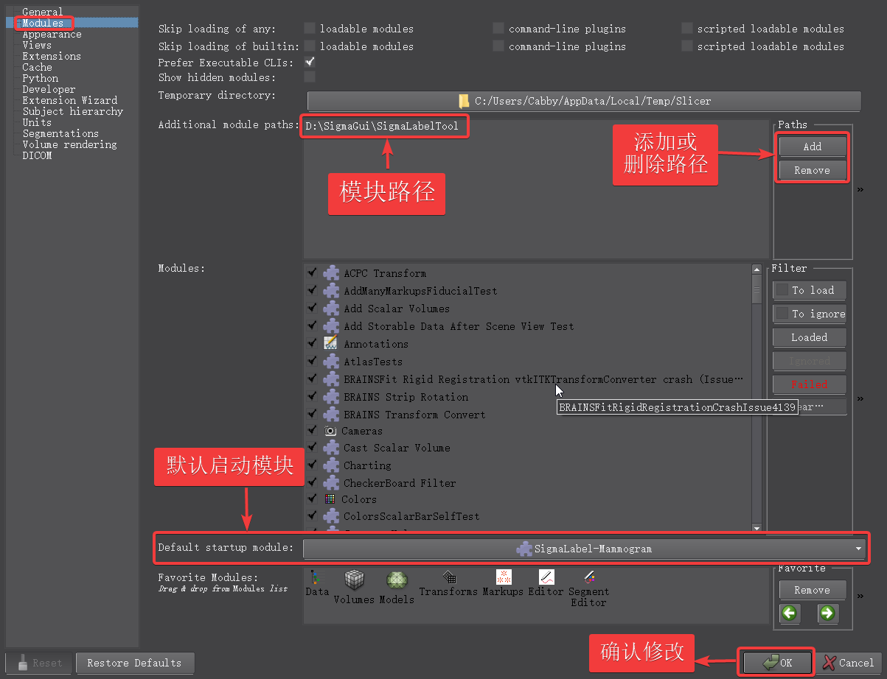

# SigmaLabelTool版本更新流程

**首先, 请先确认电脑已经安装[Slicer 4.8.1(点我下载)](https://download.slicer.org/)**

## 概述
1. 找到模块所在文件夹
2. 解压最新版本压缩包将原有文件夹替换

## 详细步骤

1. 找到模块所在文件夹
 打开Slicer, 使用快捷键`Ctril + 2`, 弹出`settings`对话框.左侧选择`Modules`, 右侧箭头所指的路径即为模块所在文件夹(此处是`D:\SigmaGui\SgmaLabelTool`)
 

 **注意: 如果此处为空, 请在相应路径下创建文件目录, 即在D盘下创建文件夹`SigmaGui`, 然后在`SigmaGui`文件夹下创建`SigmaLabelTool`文件夹, 然后点击右侧的`Add`按钮, 添加此路径, 然后点击右下角的`OK`按钮即可重启软件完成配置, 然后进行下一步.**

2. 解压最新版本压缩包将原有文件夹替换
解压最新提供的压缩包`SigmaLabelTool.zip`, 将解压出的文件夹移至`D:\SigmaGui`目录下将原有的`SigmaLabelTool`文件夹替换即可.
